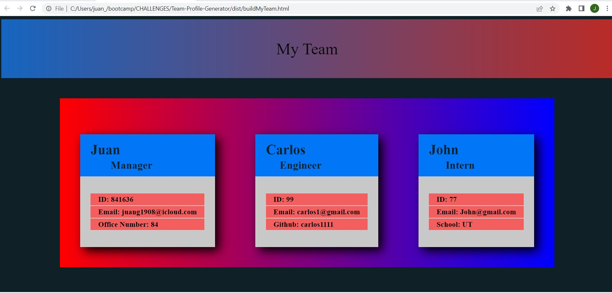
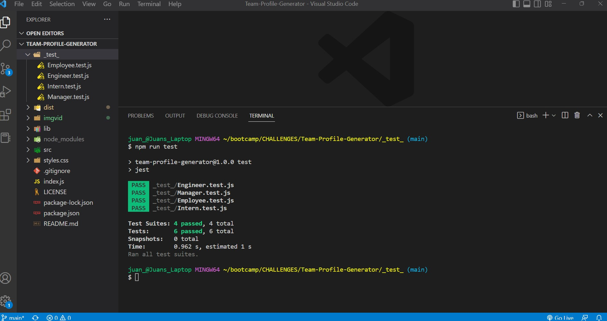

# Team-Profile-Generator

## Table of Contents

[Description](#description)
[Installation](#installation)
[Test](#test)
[Usage](#usage)
[E-mail](#email)
[Github](#github)
[License](#license)

### Description

AS A manager
I WANT to generate a webpage that displays my team's basic info
SO THAT I have quick access to their emails and GitHub profiles

### Installation

### Test

Open VS Code-Navigate _test_ file to run test and then index.js file to start building HTML application by running terminal and typing [ node index.js] in the integrated terminal. Then, fill all required information.

### Usage

Once installation is complete, you can generate your HTML FILE.

### E-mail:

juang1908@icloud.com

### Github:

If you have any questions contact me on GitHub or my personal E-mail above.

juang1908
https://github.com/Juang1908

### Walkthrough Video and Screenshot

[VIDEO DEMO](imgvid/Team-Profile-Generator.webm)

### License

    For more information about this license please visit
    [MIT License](https://opensource.org/)
